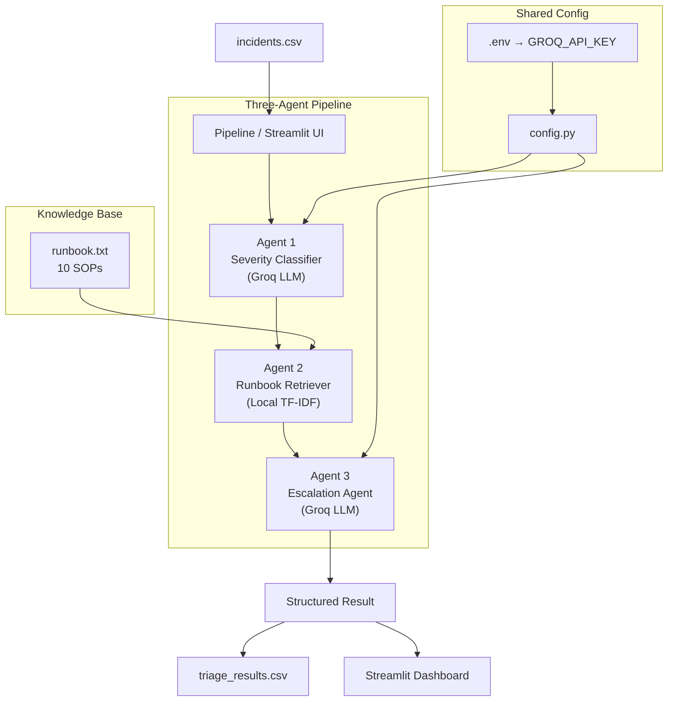

# IntelliDesk – AI-Powered Incident Triage & Auto-Escalation Agent

---

## 1. Project Overview

IntelliDesk is an AI-powered IT incident triage system that automates the first-response workflow for support tickets. It reads incoming incident descriptions, classifies their severity, retrieves the most relevant Standard Operating Procedure (SOP) from a structured runbook, and produces a plain-English escalation decision with concrete next steps — all without a human having to read and route the ticket manually.

The system is built as a three-agent pipeline orchestrated in Python, backed by a hosted Large Language Model via [Groq](https://groq.com), and exposed through an interactive [Streamlit](https://streamlit.io) dashboard.

---

## 2. Problem Statement

IT support teams receive hundreds of incidents daily. Manual triage — reading each ticket, deciding its priority, finding the right SOP, and routing it to the correct team — is slow, inconsistent, and error-prone. Critical incidents can sit unactioned while triagers work through lower-priority noise.

IntelliDesk addresses this by:

- Eliminating manual severity classification with an LLM-powered classifier.
- Matching each incident to a relevant runbook SOP using lightweight local TF-IDF retrieval (no external embedding API).
- Producing a structured, auditable escalation decision that a human engineer can immediately act on.

> **Important:** IntelliDesk assists human engineers. It does not resolve, close, or fix incidents automatically. All final decisions remain with the on-call team.

---

## 3. Features

- **Severity Classification** — classifies incidents as P1 (Critical), P2 (High), P3 (Medium), or P4 (Low).
- **Runbook Retrieval** — TF-IDF cosine similarity matching against a structured SOP knowledge base; no vector database or embedding model required.
- **Escalation Decision** — LLM-generated plain-English justification, escalation team, and recommended next steps grounded in the runbook.
- **Batch Pipeline** — processes all incidents from a CSV and writes a structured output file.
- **Streamlit Dashboard** — analyse new incidents interactively or browse batch results with severity colour coding.
- **Modular & Testable** — each agent is independently testable with mocked API clients; 94 unit tests pass without a live key.
- **Provider-Agnostic** — uses the OpenAI-compatible `chat/completions` interface; swapping to IBM watsonx.ai, OpenAI, or any compatible endpoint requires changing two lines in `src/config.py`.

---

## 4. Architecture



---

## 5. Technology Stack

| Layer | Technology |
|---|---|
| **LLM inference** | [Groq](https://groq.com) hosted API — `openai/gpt-oss-20b` (OpenAI-compatible) |
| **Designed target model** | IBM Granite (`ibm-granite/granite-3.1-8b-instruct`) — see [Note on Model Selection](#note-on-model-selection) |
| **LLM client** | `openai` Python SDK (endpoint-agnostic) |
| **Runbook retrieval** | TF-IDF + cosine similarity (stdlib `math`, `collections`) |
| **Data layer** | `pandas` |
| **Environment config** | `python-dotenv` |
| **Dashboard** | `streamlit` |
| **Testing** | `unittest` + `unittest.mock` (94 tests, zero live API calls) |
| **Language** | Python 3.10+ |

---

## 6. Folder Structure

```
IntelliDesk-triage-agent/
├── app/
│   └── main.py                  # Streamlit dashboard
├── data/
│   ├── incidents.csv            # 20 synthetic IT incident tickets
│   └── runbook.txt              # 10 SOP entries (knowledge base)
├── output/
│   └── triage_results.csv       # Generated by the pipeline
├── src/
│   ├── config.py                # Environment variable loader
│   ├── pipeline.py              # End-to-end batch pipeline
│   ├── test_connection.py       # Groq API smoke-test
│   └── services/
│       ├── __init__.py
│       ├── severity_classifier.py   # Agent 1
│       ├── runbook_retriever.py     # Agent 2
│       └── escalation_agent.py     # Agent 3
├── tests/
│   ├── test_severity_classifier.py
│   ├── test_runbook_retriever.py
│   └── test_escalation_agent.py
├── .env.example
├── .gitignore
├── requirements.txt
└── README.md
```

---

## 7. Setup Instructions

### Prerequisites

- Python 3.10 or later
- A free [Groq API key](https://console.groq.com/keys)

### Steps

```bash
# 1. Clone the repository
git clone <repo-url>
cd IntelliDesk-triage-agent

# 2. Create and activate a virtual environment
python -m venv .venv

# Windows
.venv\Scripts\activate
# macOS / Linux
source .venv/bin/activate

# 3. Install dependencies
pip install -r requirements.txt

# 4. Configure environment variables (see Section 8)
cp .env.example .env
# edit .env and set GROQ_API_KEY
```

---

## 8. Environment Variable Configuration

Copy `.env.example` to `.env` and fill in your credentials:

```env
# Required – Groq API key
# Obtain free at https://console.groq.com/keys
GROQ_API_KEY=your_groq_api_key_here
```

`src/config.py` loads this file at startup via `python-dotenv` and raises a clear `EnvironmentError` if any required variable is missing, before any network call is made.

> **Never commit `.env` to version control.** It is listed in `.gitignore`.

---

## 9. How to Run the Pipeline

The batch pipeline reads `data/incidents.csv`, runs all three agents for each ticket, and writes results to `output/triage_results.csv`.

```bash
# Smoke-test with the first 2 tickets
python src/pipeline.py --limit 2

# Full run (all 20 tickets, ~40 API calls)
python src/pipeline.py

# Custom paths
python src/pipeline.py \
  --incidents data/incidents.csv \
  --output output/triage_results.csv \
  --runbook data/runbook.txt \
  --limit 5
```

If a single ticket fails (API error, malformed response), the pipeline logs the error, writes an `ERROR` row for that ticket, and continues processing the rest.

---

## 10. How to Launch the Streamlit Dashboard

```bash
streamlit run app/main.py
```

The dashboard opens at `http://localhost:8501` and offers two modes:

| Mode | Description |
|---|---|
| **🔍 Analyze a new incident** | Enter a service and description; all three agents run live and the result is displayed immediately |
| **📊 View processed incident results** | Browse and filter the batch output from `output/triage_results.csv` |

---

## 11. Example Input and Output

### Input (single ticket)

| Field | Value |
|---|---|
| `service` | `Auth-Service` |
| `error_message` | `All employees are unable to log in. The authentication service is returning HTTP 500 errors across all regions.` |

### Output (Agent 1 + 2 + 3 combined)

| Field | Value |
|---|---|
| `severity` | `P1 - Critical` |
| `short_reason` | `Authentication service is down, causing a full outage for all users.` |
| `escalated_team` | `Identity & Access Management (IAM) Squad + SRE On-Call` |
| `final_severity` | `P1 - Critical` |
| `justification` | `The authentication service is fully down across all regions, impacting every user. The runbook confirms P1 classification and routes to the IAM Squad and SRE On-Call immediately.` |
| `recommended_next_steps` | `1. Page the IAM on-call engineer immediately. 2. Check auth-service logs for JWT or cert-related exceptions. 3. Verify token-signing key integrity in secrets manager.` |
| `requires_human_escalation` | `True` |

---

## 12. Limitations

- **No auto-resolution** — IntelliDesk classifies and routes incidents; it does not fix them. All remediation actions require a human engineer.
- **LLM hallucination risk** — the model may occasionally produce imprecise justifications or sub-optimal step recommendations. Outputs should be reviewed, not followed blindly.
- **Runbook coverage** — the retriever can only return SOPs that exist in `data/runbook.txt`. Incidents outside the current 10 SOPs will fall back to an LLM-generated recommendation without a runbook anchor.
- **Single-language support** — the pipeline expects English incident descriptions.
- **No real-time alerting** — the batch pipeline and dashboard are pull-based; there is no webhook or integration with live ticketing systems (e.g. PagerDuty, ServiceNow).
- **Rate limits** — the free Groq tier has per-minute token limits; running the full 20-ticket batch may require brief pauses.

---

## 13. Security Note

**API keys must remain in `.env` and never be committed to version control.**

- `.env` is listed in `.gitignore` and will not be tracked by Git.
- `src/config.py` validates required keys at startup and fails fast with a clear message if any are missing — preventing silent misconfiguration.
- The Streamlit dashboard does not expose any credentials to the browser or render them on screen.
- When deploying to a hosted environment (e.g. Streamlit Community Cloud, a container, or a VM), inject `GROQ_API_KEY` as a platform secret or environment variable — never bake it into a Docker image or source file.

---

## 14. Future Enhancements

| Enhancement | Description |
|---|---|
| **Semantic runbook retrieval** | Replace TF-IDF with dense embeddings (e.g. sentence-transformers) for higher-accuracy SOP matching on paraphrased descriptions |
| **Live ticket ingestion** | Webhook integration with Jira, ServiceNow, or PagerDuty to triage tickets in real time as they arrive |
| **Feedback loop** | Allow engineers to rate or correct triage decisions; use accepted corrections to refine future prompts |
| **Multi-language support** | Add a pre-processing translation step for non-English incidents |
| **IBM Granite in production** | Swap `GROQ_BASE_URL` and `GROQ_MODEL` in `src/config.py` to point at IBM watsonx.ai for enterprise governance, compliance, and Granite model access |
| **Persistent storage** | Replace the CSV output with a database (PostgreSQL, SQLite) for audit trails and trend analytics |
| **Confidence thresholding** | Reject or flag for manual review any classification where the model's confidence is below a calibrated threshold |
| **Automated test pipeline** | Add CI/CD integration (GitHub Actions) to run the 94-test suite on every pull request |

---

## Note on Model Selection

This project was designed around **IBM Granite** models (specifically `ibm-granite/granite-3.1-8b-instruct`) as the target LLM, in line with the IBM watsonx.ai tech-stack requirement.
During the build window, free-tier hosted access to Granite through the Hugging Face Inference Providers and NVIDIA NIM was unavailable — both routes returned capacity or access errors that could not be resolved without a paid tier or approved waitlist access.
To keep the agentic pipeline fully functional and demonstrable, the model was substituted with a hosted model served via **Groq's free Inference API**, which exposes the same OpenAI-compatible `/chat/completions` interface.

Because the entire stack uses `openai.OpenAI(base_url=..., api_key=...)`, swapping to IBM Granite on watsonx.ai in production requires only two changes in [`src/config.py`](src/config.py):

```python
# IBM watsonx.ai OpenAI-compatible endpoint
GROQ_BASE_URL: str = "https://us-south.ml.cloud.ibm.com/ml/v1/text/chat"
GROQ_MODEL:    str = "ibm/granite-3-1-8b-instruct"
```

No other code changes are needed. All three agents, the pipeline, and the dashboard are endpoint-agnostic by design.
